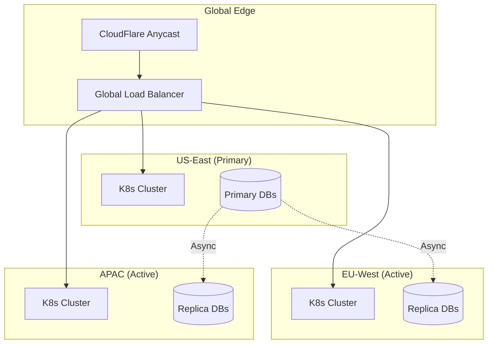

# 🚀 Social Platform Architecture Template

> **Enterprise-grade monorepo template** for building massive social platforms at scale. Inspired by Meta (Facebook + WhatsApp + Instagram), TikTok, Discord, and Netflix architectures.

[](docs/architecture/)
[](docs/architecture/15-scalability.md)
[](#tech-stack)
[](LICENSE)

---
## ⚠️ Project Status

> **🚧 This project is currently under active development.**

## 📋 Table of Contents

- [Overview](#overview)
- [Ideal Use Cases](#ideal-use-cases)
- [Architecture Highlights](#architecture-highlights)
- [Tech Stack](#tech-stack)
- [Project Structure](#project-structure)
- [Microservices](#microservices)
- [Getting Started](#getting-started)
- [Documentation](#documentation)
- [Contributing](#contributing)
- [License](#license)

---

## 🎯 Overview

This is a **production-ready architectural blueprint** and **monorepo template** designed for building hyper-scale social platforms that integrate:

- **Social Network** (Facebook-style feeds, profiles, social graph)
- **Instant Messaging** (WhatsApp-style E2E encrypted chat, groups, calls)
- **Visual Content** (Instagram-style stories, reels, photo/video sharing)
- **Live Streaming** (TikTok-style live video with real-time interactions)
- **Marketplace** (Peer-to-peer commerce integrated into the social graph)
- **Advertising Platform** (Meta-style targeted ads with real-time bidding)
- **AI-Powered Recommendations** (TikTok/Netflix-style personalized feeds)

Built for **100M+ daily active users**, millions of concurrent connections, and global multi-region deployment.

---

## 💡 Ideal Use Cases

This template is specifically designed for:

### 1. **Social Super-Apps**
Platforms combining social networking, messaging, and content sharing in a unified ecosystem (like WeChat, Meta apps, or TikTok).

### 2. **Community-Driven Platforms**
Reddit-like communities, Discord-like servers, or Facebook Groups with rich media, real-time chat, and content moderation.

### 3. **Creator Economy Platforms**
Instagram/TikTok-like platforms for content creators with monetization, analytics, live streaming, and fan engagement.

### 4. **Enterprise Social Intranets**
Large-scale internal communication platforms combining feeds, messaging, video conferencing, and document sharing.

### 5. **Marketplace-Integrated Social Networks**
Social commerce platforms where users discover, share, and purchase products within their social graph (like Facebook Marketplace or Xiaohongshu).

### 6. **Real-Time Collaboration Platforms**
Slack/Discord alternatives with integrated project management, video calls, and social features.

### 7. **Niche Social Networks**
Vertical social platforms for specific interests (fitness, gaming, education) requiring messaging, feeds, and media sharing.

---

## 🏗️ Architecture Highlights

### Core Principles

| Principle | Implementation |
|-----------|---------------|
| **Domain-Driven Design** | Bounded contexts per microservice |
| **Event-Driven Architecture** | Apache Kafka as event backbone |
| **CQRS + Event Sourcing** | For feed, messaging, and analytics |
| **Database per Service** | Polyglot persistence strategy |
| **API-First** | Federated GraphQL + gRPC |
| **Zero Trust Security** | mTLS, OAuth2/OIDC, E2E encryption |

### Scale Targets

| Metric | Target |
|--------|--------|
| **Daily Active Users** | 100M+ |
| **Concurrent Connections** | 10M+ WebSockets |
| **Messages/Second** | 1M+ |
| **Feed Requests/Second** | 500K+ |
| **Video Views/Second** | 1M+ |
| **Global Latency** | <100ms p99 |
| **Availability** | 99.99% |

### Multi-Region Architecture



---

## 🛠️ Tech Stack

### Backend
| Technology | Purpose |
|------------|---------|
| **Go** | High-performance APIs, microservices |
| **Rust** | Media processing, performance-critical paths |
| **Python** | ML/AI services, data processing |
| **Elixir/Phoenix** | Real-time WebSocket gateway |

### Frontend
| Technology | Purpose |
|------------|---------|
| **Next.js 15** | Web app (App Router, RSC, SSR) |
| **Swift + SwiftUI** | iOS native app |
| **Kotlin + Jetpack Compose** | Android native app |

### Data & Messaging
| Technology | Purpose |
|------------|---------|
| **PostgreSQL + Citus** | User data, ACID transactions |
| **Cassandra** | Messages, activity logs, time-series |
| **Neo4j** | Social graph, relationships |
| **Redis Cluster** | Cache, sessions, real-time presence |
| **Elasticsearch** | Search, content discovery |
| **Apache Pinot** | Real-time analytics |
| **Milvus** | Vector search, recommendations |
| **Apache Kafka** | Event streaming, event sourcing |
| **Apache Flink** | Stream processing |

### Infrastructure
| Technology | Purpose |
|------------|---------|
| **Kubernetes (EKS)** | Container orchestration |
| **Istio** | Service mesh, mTLS, traffic management |
| **Terraform** | Infrastructure as Code |
| **ArgoCD** | GitOps deployments |
| **Prometheus + Grafana** | Monitoring |
| **Jaeger** | Distributed tracing |
| **Loki** | Log aggregation |

### AI/ML
| Technology | Purpose |
|------------|---------|
| **PyTorch** | Deep learning models |
| **FAISS + Milvus** | Vector similarity search |
| **Triton Inference Server** | Model serving |
| **MLflow** | ML lifecycle management |

---

## 📁 Project Structure

```
social-platform/
├── 📁 .github/                 # CI/CD workflows, templates
├── 📁 .vscode/                 # VS Code settings, extensions
├── 📁 docs/                    # Architecture docs, ADRs, runbooks
│   ├── architecture/           # 24 detailed architecture documents
│   ├── adr/                    # Architecture Decision Records
│   └── diagrams/               # C4 model, data flow diagrams
├── 📁 infrastructure/          # Terraform, K8s, Helm, Docker
│   ├── terraform/              # Multi-environment IaC
│   ├── kubernetes/             # K8s manifests, Istio config
│   ├── helm/                   # Helm charts
│   └── docker/                 # Dockerfiles, compose files
├── 📁 services/                # Microservices (polyglot)
│   ├── api-gateway/            # GraphQL Federation, REST, WebSockets
│   ├── identity-service/       # Auth, OAuth2, MFA, sessions
│   ├── social-graph-service/   # Follows, friends, graph algorithms
│   ├── messaging-service/      # E2E encrypted chat, groups
│   ├── feed-service/           # Feed generation, ranking, fan-out
│   ├── media-service/          # Upload, transcoding, streaming (Rust)
│   ├── notification-service/   # Push, email, SMS
│   ├── recommendation-service/ # AI recommendations (Python)
│   ├── ads-service/            # Ad serving, auction engine
│   ├── analytics-service/      # Event ingestion, reporting
│   ├── moderation-service/     # AI content moderation
│   └── search-service/         # Full-text search, suggestions
├── 📁 shared/                  # Shared libraries
│   ├── go/                     # Go utilities, middleware
│   ├── python/                 # Python utilities
│   └── proto/                  # gRPC/Protobuf definitions
├── 📁 web/                     # Frontend monorepo (Turborepo)
│   ├── apps/
│   │   ├── web/                # Next.js main app
│   │   └── admin/              # Admin dashboard
│   └── packages/
│       ├── ui/                 # Design system
│       ├── config/             # Shared configs
│       └── utils/              # Shared utilities
├── 📁 mobile/                  # Mobile apps
│   ├── ios/                    # Swift + SwiftUI
│   └── android/                # Kotlin + Jetpack Compose
├── 📁 ml/                      # ML models, training, serving
├── 📁 data/                    # Data engineering pipelines
├── 📁 tests/                   # E2E, integration, load tests
└── 📁 scripts/                 # Automation scripts
```

---

## 🔧 Microservices

### 1. API Gateway (`services/api-gateway/`)
- **Tech**: Go + Gin + Apollo Federation
- **Responsibilities**:
  - GraphQL schema federation
  - REST API proxying
  - WebSocket connection management
  - Rate limiting, auth middleware
  - Request routing to microservices

### 2. Identity Service (`services/identity-service/`)
- **Tech**: Go + PostgreSQL + Redis
- **Responsibilities**:
  - User registration/authentication
  - OAuth2/OIDC flows
  - JWT issuance and validation
  - Multi-factor authentication (TOTP, WebAuthn)
  - Session management
  - Device fingerprinting

### 3. Social Graph Service (`services/social-graph-service/`)
- **Tech**: Go + Neo4j + Cassandra + Redis
- **Responsibilities**:
  - Follow/unfollow relationships
  - Friend connections
  - Graph traversals (BFS, community detection)
  - Influence scoring
  - Feed candidate generation

### 4. Messaging Service (`services/messaging-service/`)
- **Tech**: Go + Elixir + Cassandra + Redis
- **Responsibilities**:
  - 1:1 and group messaging
  - End-to-end encryption (Signal Protocol)
  - Message history and search
  - Presence and typing indicators
  - Multi-device synchronization

### 5. Feed Service (`services/feed-service/`)
- **Tech**: Go + Cassandra + Redis + Pinot
- **Responsibilities**:
  - Feed generation (push/pull hybrid)
  - Content ranking and scoring
  - Fan-out to user timelines
  - Cache warming and invalidation

### 6. Media Service (`services/media-service/`)
- **Tech**: Rust + FFmpeg + S3 + CDN
- **Responsibilities**:
  - Image/video upload and processing
  - Transcoding (HLS/DASH)
  - Thumbnail generation
  - Content delivery optimization
  - Live streaming ingestion

### 7. Recommendation Service (`services/recommendation-service/`)
- **Tech**: Python + PyTorch + Milvus + Redis
- **Responsibilities**:
  - Two-tower candidate generation
  - DeepFM ranking
  - Real-time feature computation
  - A/B testing framework
  - Model serving via Triton

### 8. Ads Service (`services/ads-service/`)
- **Tech**: Go + PostgreSQL + Kafka
- **Responsibilities**:
  - Campaign management
  - Real-time bidding (GSP/Vickrey)
  - User targeting and segmentation
  - Attribution and billing
  - Performance analytics

---

## 🚀 Getting Started

### Prerequisites

- **Docker** & **Docker Compose**
- **Go** 1.22+
- **Node.js** 20+ & **pnpm**
- **Python** 3.11+
- **Rust** 1.75+
- **Terraform** 1.7+
- **kubectl** & **Helm**

### Quick Start

```bash
# Clone the repository
git clone https://github.com/your-org/social-platform.git
cd social-platform

# Start local development environment
make dev-up

# This starts:
# - PostgreSQL, Cassandra, Neo4j, Redis, Elasticsearch
# - Kafka + Zookeeper
# - All microservices in Docker
# - Next.js dev server
# - Mobile app simulators

# Run database migrations
make db-migrate

# Seed development data
make seed-data

# Access the applications:
# Web: http://localhost:3000
# API Gateway: http://localhost:8080
# GraphQL Playground: http://localhost:8080/graphql
# Kafka UI: http://localhost:8081
# Grafana: http://localhost:3001
```

### Development Commands

```bash
# Start individual services
make start-gateway
make start-identity
make start-messaging

# Run tests
make test-unit
make test-integration
make test-e2e

# Build for production
make build-all

# Deploy to staging
make deploy-staging

# Deploy to production
make deploy-production
```

---

## 📚 Documentation

### Architecture Documents

| Document | Description |
|----------|-------------|
| [01. General Architecture](docs/architecture/01-general-architecture.md) | High-level system design |
| [02. Microservices](docs/architecture/02-microservices.md) | Service boundaries and communication |
| [03. Database Design](docs/architecture/03-database-design.md) | Polyglot persistence strategy |
| [04. API Design](docs/architecture/04-api-design.md) | GraphQL federation, gRPC, REST |
| [05. Real-time Communication](docs/architecture/05-realtime-communication.md) | WebSockets, presence, chat |
| [06. Authentication](docs/architecture/06-authentication.md) | OAuth2, OIDC, E2E encryption |
| [07. Social Graph](docs/architecture/07-social-graph.md) | Neo4j modeling, TAO-inspired cache |
| [08. Infrastructure](docs/architecture/08-infrastructure.md) | Cloud-native architecture |
| [09. DevOps](docs/architecture/09-devops.md) | CI/CD, GitOps, deployments |
| [10. Security](docs/architecture/10-security.md) | Zero Trust, defense in depth |
| [11. AI/ML](docs/architecture/11-ai-ml.md) | Recommendation engine, MLOps |
| [12. Ads System](docs/architecture/12-ads-system.md) | Real-time bidding, targeting |
| [13. Video & Media](docs/architecture/13-video-media.md) | Processing, streaming, CDN |
| [14. Recommendations](docs/architecture/14-recommendations.md) | Multi-stage ranking |
| [15. Scalability](docs/architecture/15-scalability.md) | 100M+ users strategy |
| [16. Mobile Architecture](docs/architecture/16-mobile-architecture.md) | iOS/Android native apps |
| [17. Observability](docs/architecture/17-observability.md) | Monitoring, tracing, logging |
| [18. Event-Driven](docs/architecture/18-event-driven.md) | Kafka, event schemas, flows |
| [19. Data Lake](docs/architecture/19-data-lake.md) | Lakehouse architecture |
| [20. Cost Estimation](docs/architecture/20-cost-estimation.md) | Infrastructure costs |
| [21. Roadmap](docs/architecture/21-roadmap.md) | 18-month development plan |
| [22. Team Organization](docs/architecture/22-team-organization.md) | Engineering structure |
| [23. Risk Assessment](docs/architecture/23-risk-assessment.md) | Technical risks |
| [24. Scaling Strategy](docs/architecture/24-scaling-strategy.md) | 100M+ user checklist |

### Architecture Decision Records (ADRs)

See [`docs/adr/`](docs/adr/) for detailed decision records on:
- Database selection per service
- Message broker (Kafka vs Pulsar)
- GraphQL federation strategy
- Mobile native vs cross-platform
- And more...

---

## 🤝 Contributing

We welcome contributions! Please see [CONTRIBUTING.md](CONTRIBUTING.md) for guidelines.

### Development Workflow

1. Fork the repository
2. Create a feature branch (`git checkout -b feature/amazing-feature`)
3. Commit your changes (`git commit -m 'feat: add amazing feature'`)
4. Push to the branch (`git push origin feature/amazing-feature`)
5. Open a Pull Request

### Commit Convention

We follow [Conventional Commits](https://www.conventionalcommits.org/):

- `feat:` New feature
- `fix:` Bug fix
- `docs:` Documentation changes
- `style:` Code style changes
- `refactor:` Code refactoring
- `perf:` Performance improvements
- `test:` Test changes
- `chore:` Build/tooling changes

---

## 📄 License

This project is licensed under the MIT License - see the [LICENSE](LICENSE) file for details.

---

## 🙏 Acknowledgments

This architecture is inspired by and learns from:

- **Meta** (Facebook, WhatsApp, Instagram) - Social graph and messaging at scale
- **TikTok** - AI-driven recommendation systems
- **Discord** - Real-time messaging and presence
- **Netflix** - Microservices and chaos engineering
- **Uber** - Geospatial and real-time systems
- **X/Twitter** - Feed algorithms and fan-out strategies

---

<div align="center">

**[⬆ Back to Top](#-social-platform-architecture-template)**

Built with ❤️ by the engineering team

</div>
